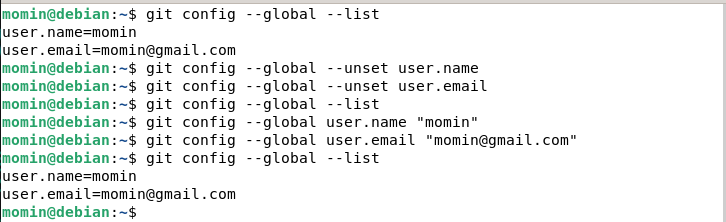
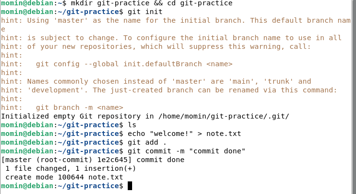
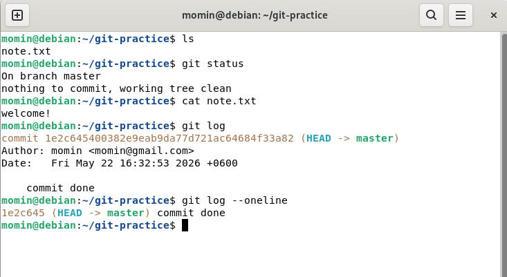
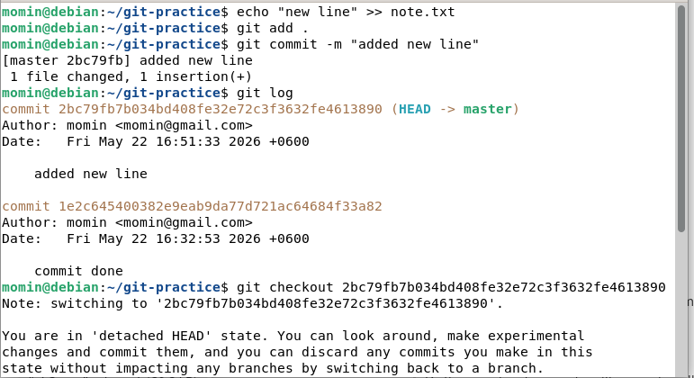
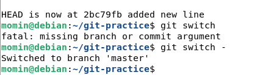

## Basic git

In this repo i am documenting my git learning progress.
and this is bare minimum i should learn.

this set up is in local machine to practice. without git push/ pull it wont effect github account content.

**git set up**

**git clone**
- git clone < url >

we all know abut git clone and used it without knowing it is a git command.

 **git command**
- git init                   > turn any folder into a git repo
- git add .                  > stage everything (. means all files) and keep space between add and .(dot). 
- git commit -m "my message" > save a snapshot

if you wanna match GITHUB : than use 
>git config --global init.defaultBranch main

**git status and log**

- git log = history . and we use this to see previous commits 
- git status = what files change. 

**git pull** 
- Get latest updates
>git pull
- Updates your local copy with any new changes from the remote.
>i didnt use bc i am practicing on my local machine

**git push** 
- Upload your changes to GitHub
>git push origin main
- Sends  committed changes to GitHub. 
- This is how notes/scripts saved to repo from terminal.

for first time you have to set this arg. but after that git push will be enough.
>only these two (push/pull) commands touch GitHub, everything else is local

**git checkout**

- git switch -         > go back to previous branch
- git switch master    > go to specific branch by name

**note - git checkout**
- git checkout <hash> take me to old commit 
- why we need this ?
  >we need this bc sometime something is good in past commit but new commit have problem so to see what messed up. we use this . 
- switch is like cd but in git .
- detached HEAD = normal, just means you left the branch
- git switch - to come back to master ( present github = main)
- will need this in Bandit 27-31 and managing big repos later

if you wanna remove. just remove dir 
>rm -rf < dir name >

## Adding repo to github 

- Create empty repo on GitHub (don't add README)
- git remote add origin <your repo url> (one time set up connection)
- git push origin main
- done — repo is live on your GitHub

**important info**

You have to set your github username and email you registered github with

after one time set up connection- whenever you make changes just add and commmit 
>git add .

>git commit -m "update notes / anything "

>git push 

(you have to be in same dir where you make remote connection)
